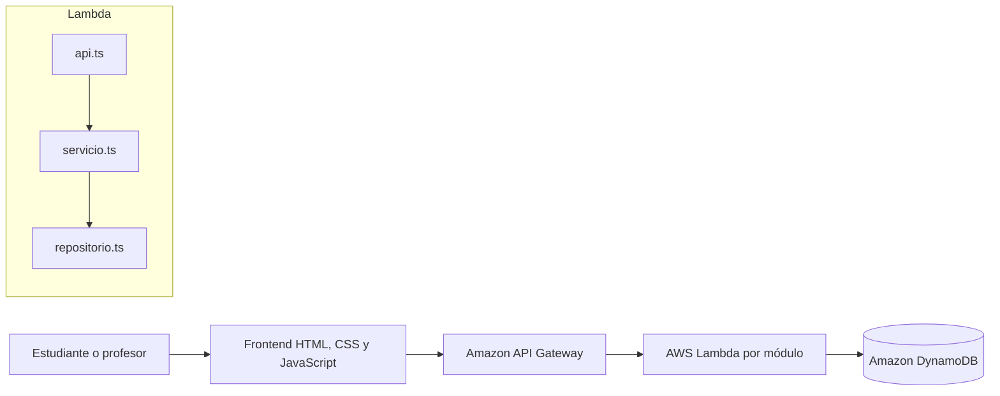

# Misión Emprende UDD

Misión Emprende es una experiencia educativa gamificada para desarrollar habilidades
de emprendimiento en estudiantes. La plataforma permite que un profesor cree y
controle sesiones, organice grupos y acompañe a los participantes a través de
distintas fases con desafíos, actividades colaborativas, temporizadores y rankings.

Este repositorio documenta y desarrolla la modernización del sistema original. El
objetivo principal es evolucionar desde un backend monolítico en Django y MySQL hacia
una **Clean Architecture adaptada a servicios serverless de AWS**, conservando el
frontend y el comportamiento funcional del juego.

## Objetivos de la modernización

- Separar la lógica de negocio de HTTP, AWS y la persistencia.
- Reducir el acoplamiento entre las fases del juego.
- Permitir que cada módulo evolucione y se pruebe de manera independiente.
- Reemplazar el servidor Django persistente por funciones AWS Lambda.
- Migrar la persistencia de MySQL a una tabla única en DynamoDB.
- Mantener decisiones, requisitos y trazabilidad mediante la metodología BMAD.

La migración es progresiva: el código Django se conserva como referencia del sistema
legado mientras se construye y valida el backend serverless.

## Arquitectura

El backend nuevo aplica Clean Architecture mediante módulos funcionales. Cada módulo
se divide en tres responsabilidades:

```text
api.ts  →  servicio.ts  →  interfaz de repositorio
                              ↑
                       repositorio.ts
```

- `api.ts`: adaptador de entrada. Recibe eventos de API Gateway, valida la petición,
  llama al caso de uso y construye la respuesta HTTP.
- `servicio.ts`: contiene los casos de uso y las reglas del dominio. No depende
  directamente del SDK de AWS.
- `repositorio.ts`: adaptador de salida. Implementa la persistencia en DynamoDB y
  encapsula sus claves, consultas y detalles técnicos.

Las dependencias apuntan hacia la lógica de negocio. Los servicios trabajan contra
contratos y reciben sus dependencias por parámetros, sin requerir un contenedor de
inyección de dependencias.

### Arquitectura objetivo



La infraestructura se define con AWS SAM. El backend utiliza una tabla DynamoDB por
ambiente con claves `PK` y `SK`, más un índice secundario `GSI1`. Las convenciones de
claves quedan encapsuladas en los repositorios.

## Estructura del repositorio

```text
.
├── backend-serverless/   # Backend objetivo: TypeScript, Lambda y DynamoDB
│   ├── src/
│   │   ├── acceso/       # Ingreso y autenticación de grupos
│   │   ├── profesor/     # Acceso, sesiones y control del profesor
│   │   ├── sesiones/     # Consulta del estado de una sesión
│   │   ├── fase1/        # Primera fase del juego
│   │   ├── fase2/        # Segunda fase del juego
│   │   ├── fase3/        # Tercera fase del juego
│   │   └── compartido/   # Seguridad, respuestas y acceso común a datos
│   ├── pruebas/          # Pruebas automatizadas con Vitest
│   ├── scripts/          # Preparación del ambiente local
│   └── template.yaml     # Infraestructura como código con AWS SAM
├── frontend/             # Aplicación web del juego y panel del profesor
├── config/               # Configuración del backend Django legado
├── manage.py             # Entrada del sistema Django legado
├── docker-compose.yml    # Entorno local legado con Django y MySQL
├── _bmad/                # Flujos, agentes y configuración de la metodología BMAD
├── _bmad-output/         # PRD, arquitectura y artefactos generados con BMAD
├── documentosIA/         # Informes y registro de decisiones del proceso
└── Dockerfile            # Contenedor del sistema legado
```

Todo el contenido de `_bmad/` y `_bmad-output/` se versiona porque forma parte de la
metodología de trabajo y de la trazabilidad arquitectónica del proyecto.

## Metodología BMAD

El proyecto emplea **BMAD (Breakthrough Method for Agile AI-Driven Development)** para
organizar el análisis, la planificación y la implementación asistida. Sus artefactos
permiten conectar el problema original con las decisiones técnicas y el trabajo de
desarrollo.

El flujo aplicado incluye:

1. Análisis y auditoría del sistema Django existente.
2. Definición del producto y de sus requisitos mediante un PRD.
3. Diseño de la arquitectura objetivo y sus reglas de consistencia.
4. Descomposición del trabajo en épicas e historias.
5. Implementación y verificación incremental por módulos.
6. Registro de decisiones y conservación de los artefactos generados.

Los documentos principales están en:

- `_bmad-output/planning-artifacts/prds/`: requisitos del producto.
- `_bmad-output/planning-artifacts/architecture/`: arquitectura y decisiones.
- `_bmad-output/planning-artifacts/epics.md`: planificación por épicas.
- `documentosIA/informesSistema/`: diagnóstico y guías complementarias.

## Tecnologías

### Arquitectura objetivo

- Node.js 22 y TypeScript.
- AWS Lambda y API Gateway.
- Amazon DynamoDB.
- AWS SAM y esbuild.
- Vitest para pruebas automatizadas.
- Frontend en HTML, CSS y JavaScript.

### Sistema legado

- Python y Django.
- MySQL 8.
- Docker y Docker Compose.

## Ejecución del backend serverless

### Requisitos

- Node.js 22 o superior.
- Docker.
- AWS SAM CLI.

Instalar las dependencias:

```bash
cd backend-serverless
npm install
```

Comprobar tipos, pruebas y empaquetado:

```bash
npm run verificar
```

Levantar DynamoDB local y preparar datos de prueba:

```bash
npm run local:base
npm run local:preparar
cp env.local.example.json env.local.json
```

Construir e iniciar la API:

```bash
npm run construir
npm run local:api
```

Por defecto, la API local queda disponible en `http://127.0.0.1:3000`.
Las instrucciones específicas y ejemplos de peticiones se encuentran en
[`backend-serverless/README.md`](backend-serverless/README.md).

## Ejecución del sistema legado

El sistema Django requiere un archivo `.env` local con la configuración de MySQL.
Luego puede iniciarse con:

```bash
docker compose up --build
```

El servicio web queda expuesto en `http://localhost:8000` y MySQL en el puerto local
`3307`. Este entorno se mantiene como referencia durante la migración y no representa
la arquitectura objetivo.

## Convenciones principales

- Código, nombres de dominio y mensajes escritos preferentemente en español.
- Archivos del backend en `camelCase` y archivos del frontend en `kebab-case`.
- Ningún `servicio.ts` debe importar directamente el SDK de AWS.
- Ningún módulo debe importar el repositorio interno de otro módulo.
- La autenticación y las respuestas HTTP se gestionan mediante utilidades compartidas.
- Las pruebas de servicios usan repositorios falsos para aislar la lógica de negocio.
- Los secretos y configuraciones locales nunca se versionan; se proporcionan archivos
  de ejemplo cuando son necesarios.

## Estado del proyecto

Actualmente existen módulos serverless para acceso, profesor, sesiones y las tres
primeras fases. La arquitectura contempla la incorporación progresiva de las fases
restantes y del catálogo administrativo. Los artefactos BMAD constituyen la fuente de
referencia para el alcance, las decisiones adoptadas y el trabajo pendiente.

## Seguridad y archivos locales

No deben subirse al repositorio archivos `.env`, credenciales, claves privadas,
respaldos de bases de datos, dependencias instaladas ni artefactos de compilación.
El archivo `.gitignore` contiene las exclusiones comunes para Django, Node.js,
AWS SAM, editores y sistemas operativos.
