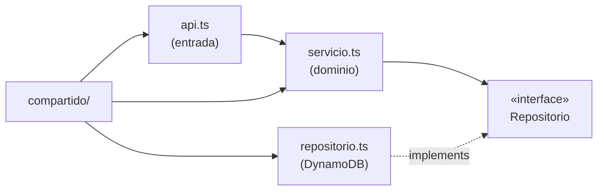
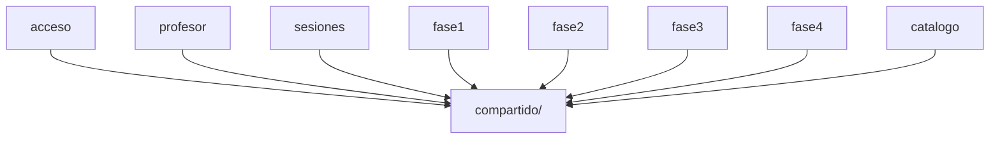
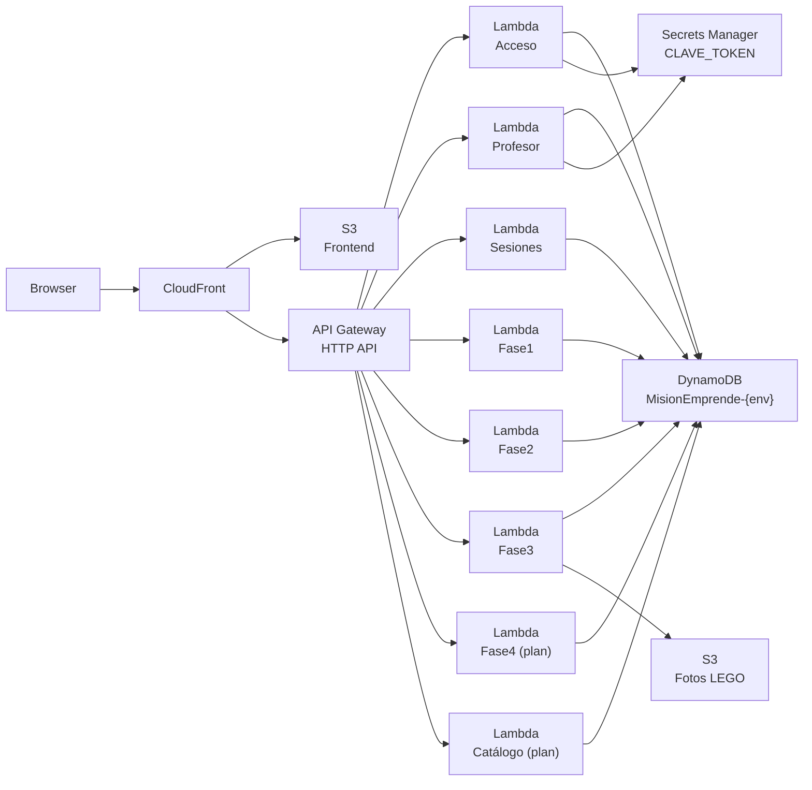

# Architecture Spine — Misión Emprende UDD

## Design Paradigm

**Clean Architecture adaptada a Serverless** (ports & adapters, sin contenedor IoC). Cada módulo de dominio expone exactamente tres capas:

- `api.ts` — adaptador de entrada (Lambda handler): parsea evento, delega al servicio, serializa respuesta. Sin lógica de negocio.
- `servicio.ts` — casos de uso y reglas del dominio. Sin imports directos del AWS SDK.
- `repositorio.ts` — adaptador de salida: toda interacción con DynamoDB. Define la interfaz del repositorio; el servicio depende de la interfaz, nunca de la clase concreta.

La inyección de dependencias se realiza pasando el repositorio como parámetro de función — sin framework IoC.



## Invariants & Rules

### AD-1 — Sin importaciones cruzadas entre repositorios de módulo

- **Binds:** acceso, profesor, sesiones, fase1, fase2, fase3, fase4, catalogo
- **Prevents:** acoplamiento a implementación DynamoDB interna de otra fase; dos fases evolucionando la misma entidad incompatiblemente
- **Rule:** Ningún módulo importa el `repositorio.ts` de otro módulo. Datos compartidos entre fases se acceden mediante contratos explícitos (interfaces TypeScript) definidos en `compartido/contratos/`. La implementación DynamoDB de esos contratos vive fuera de los módulos de fase.

### AD-2 — Máquina de estados del juego en compartido/

- **Binds:** profesor, fase1, fase2, fase3, fase4, cualquier Lambda de orquestación futura
- **Prevents:** strings de fase hardcodeados por módulo; lógica de transición duplicada; ciclos de importación entre módulos funcionales
- **Rule:** La definición canónica de estados (`FASES_ORDEN`), tiempos por defecto (`TIEMPOS_POR_FASE`) y las constantes de cada string de fase viven en `compartido/maquinaEstados.ts`. `compartido/` no importa de ningún módulo funcional. Todo módulo que valide el estado activo de una sesión importa las constantes desde aquí — nunca usa strings literales.

### AD-3 — Identidad del profesor en el token

- **Binds:** compartido/seguridad.ts, profesor/api.ts, todas las rutas de sesión del profesor
- **Prevents:** acceso cruzado entre profesores; aislamiento por oscuridad en lugar de por diseño
- **Rule:** Todo token de profesor incluye `profesorId` estable. El backend extrae `profesorId` del token en cada request y lo usa como filtro obligatorio en todas las queries de sesiones — nunca del body o query string. La implementación actual (contraseña compartida, token sin `profesorId`) es **deuda técnica explícita**: FR-005 no está implementado hasta que el token lleve identidad.

### AD-4 — Rankings sincrónicos; EventBridge diferido

- **Binds:** fase1, fase2, fase3, fase4
- **Prevents:** introducción de Lambda asíncrona de ranking o bus de eventos sin acuerdo explícito
- **Rule:** El cálculo de ranking se ejecuta síncronamente en endpoints `/api/faseN/ranking` dentro de cada módulo de fase. EventBridge, SNS y arquitecturas async de ranking quedan diferidos.

### AD-5 — Dirección de dependencias hacia el núcleo [ADOPTED]

- **Binds:** todos los módulos
- **Prevents:** lógica de negocio en api.ts; queries DynamoDB en servicio.ts; inversión de dependencia
- **Rule:** `api.ts` → `servicio.ts` → interfaz repositorio. La flecha nunca se invierte. `servicio.ts` no importa el AWS SDK directamente.

### AD-6 — Tabla DynamoDB única con GSI [ADOPTED]

- **Binds:** todos los repositorios
- **Prevents:** múltiples tablas por dominio; joins cross-tabla; prefijos de clave en servicio.ts
- **Rule:** Una tabla por entorno (`MisionEmprende-{env}`), claves `PK` (hash) + `SK` (range), GSI1 (`GSI1PK`, `GSI1SK`) para búsquedas secundarias. Los prefijos (`SESION#`, `GRUPO#`, `CODIGO#`, `PROFESOR#`) viven exclusivamente en `repositorio.ts`.

### AD-7 — Autenticación exclusivamente via helpers compartidos [ADOPTED]

- **Binds:** todo api.ts que requiera autenticación
- **Prevents:** validación manual del token en código de aplicación; errores de seguridad por omisión
- **Rule:** Grupos: `contextoDesdeEvento(event)`. Profesores: `validarProfesorDesdeEvento(event)`. Ningún `api.ts` parsea ni valida tokens manualmente.

## Consistency Conventions

| Concern | Convention |
|---|---|
| Naming archivos backend | `camelCase` (`baseDatos.ts`, `maquinaEstados.ts`) |
| Naming archivos frontend | `kebab-case` (`sopa-letras.html`, `modo-equipo.js`) |
| Idioma del código | Español para todo (variables, funciones, interfaces, mensajes). Inglés solo para tipos AWS SDK y términos sin traducción natural (`token`, `payload`) |
| Constantes de error | `SNAKE_UPPER` en español (`CODIGO_INVALIDO`, `TOKEN_EXPIRADO`) |
| Prefijos DynamoDB | `SNAKE_UPPER#` — solo en `repositorio.ts` |
| Imports TypeScript | Extensión `.js` obligatoria (moduleResolution NodeNext) |
| Forma de error al cliente | `{ ok: false, codigo: string, error: string }` vía `ErrorAplicacion` |
| Validación de fase activa | Siempre contra constantes de `compartido/maquinaEstados.ts`; nunca strings literales |
| Idempotencia | Toda operación que entregue tokens usa `ConditionExpression` DynamoDB |
| Tests | Un archivo por módulo en `pruebas/`; prueban `servicio.ts` con repositorios falsos (no `vi.mock`) |

## Stack

| Nombre | Versión |
|---|---|
| Node.js (Lambda runtime) | 22.x |
| TypeScript | 7.0.2 |
| AWS SAM | latest |
| @aws-sdk/lib-dynamodb | 3.1085.0 |
| esbuild | 0.28.1 |
| Vitest | 4.1.10 |
| tsx | 4.23.1 |

## Structural Seed

```text
backend-serverless/
  src/
    compartido/           # Transversal — cero dependencias a módulos funcionales
      baseDatos.ts        # Cliente DynamoDB + nombreTabla()
      respuestas.ts       # respuestaJson, leerJson, responderError, ErrorAplicacion
      seguridad.ts        # Crear/validar tokens, contextoDesdeEvento, validarProfesorDesdeEvento
      maquinaEstados.ts   # FASES_ORDEN, TIEMPOS_POR_FASE, constantes de string de fase [CREAR]
      contratos/          # Interfaces compartidas entre fases (e.g. RepositorioResultadoLego) [CREAR al necesitar]
    acceso/               # Login de grupos — emite JWT de grupo
    profesor/             # Auth de profesor, CRUD sesiones, control de fases y timer
    sesiones/             # Estado actual de sesión (polling de grupos)
    fase1/                # Sopa de Letras [IMPLEMENTADO]
    fase2/                # Bubble Map de Empatía [IMPLEMENTADO]
    fase3/                # Creatividad LEGO [IMPLEMENTADO]
    fase4/                # Pitch y Evaluación Cruzada [PLANIFICADO]
    catalogo/             # Gestión de temáticas y desafíos (admin) [PLANIFICADO]
  pruebas/                # Tests Vitest — un archivo por módulo
  template.yaml           # Definición SAM completa

frontend/
  acceso/                 # Login grupos y profesor
  compartido/             # api.js, imágenes, estilos compartidos
  juego/
    fase1..fase4/         # HTML/CSS/JS por fase
    profesor/             # Panel de control del profesor
  catalogo/               # Panel admin [PLANIFICADO]
```

**Dependencias entre módulos (backend):**



**Infraestructura AWS:**



**Entidades DynamoDB (single-table):**

```mermaid
erDiagram
  SESION {
    string PK "SESION#{sesionId}"
    string SK "METADATOS"
    string GSI1PK "PROFESOR#{profesorId}"
    string GSI1SK "SESION#{ts}#{sesionId}"
    string fase
    boolean timerCorriendo
    string timerFin
  }
  GRUPO {
    string PK "SESION#{sesionId}"
    string SK "GRUPO#{grupoId}"
    string GSI1PK "CODIGO#{codigo}"
    string GSI1SK "GRUPO#{grupoId}"
    number tokens
  }
  ALUMNO {
    string PK "SESION#{sesionId}"
    string SK "ALUMNO#{alumnoId}"
    string grupoId
  }
  SESION ||--o{ GRUPO : contiene
  SESION ||--o{ ALUMNO : contiene
  GRUPO ||--o{ ALUMNO : agrupa
```

## Capability → Architecture Map

| Capacidad / FR | Vive en | Gobernado por |
|---|---|---|
| Login de grupos (FR-003) | `acceso/` | AD-7, AD-6 |
| Auth de profesor (FR-001, FR-002) | `profesor/`, `compartido/seguridad.ts` | AD-3, AD-7 |
| Gestión de sesiones (F3) | `profesor/` | AD-3, AD-5 |
| Máquina de estados y transiciones (F4, FR-015, FR-016) | `compartido/maquinaEstados.ts` + `profesor/` | AD-2, AD-5 |
| Temporizadores por fase (FR-019..FR-023) | `profesor/servicio.ts` | AD-5 |
| Sopa de Letras (F6, FR-024..FR-028) | `fase1/` | AD-1, AD-2, AD-4 |
| Bubble Map de Empatía (F7, FR-029..FR-032) | `fase2/` | AD-1, AD-2, AD-4 |
| Creatividad LEGO / fotos S3 (F8, FR-033..FR-038) | `fase3/`, S3 | AD-1, AD-2, AD-4 |
| Pitch y Evaluación Cruzada (F9, FR-039..FR-047) | `fase4/` [PLANIFICADO] | AD-1, AD-2, AD-4 |
| Rankings (F10, FR-048..FR-051) | endpoint síncrono en cada `faseN/` | AD-4 |
| Estado actual de sesión (F11, FR-052, FR-053) | `sesiones/` | AD-5, AD-7 |
| Catálogo temáticas/desafíos (F2, FR-007..FR-010) | `catalogo/` [PLANIFICADO] | AD-1, AD-5 |

## Deferred

- **EventBridge / rankings async (FR-018, FR-051):** Diferido por decisión (AD-4). Revisar si se requiere demostrar arquitectura event-driven antes de la entrega académica.
- **Cognito User Pool (FR-001, NFR-012):** Disponibilidad en AWS Academy no confirmada. Bloquea FR-001. Verificar con `aws cognito-idp create-user-pool` antes de comenzar el módulo de autenticación definitiva.
- **profesorId en token (AD-3):** Deuda técnica explícita. FR-005 no implementado hasta que el token lleve identidad estable del profesor.
- **Contrato compartido entre fases (AD-1):** `compartido/contratos/RepositorioResultadoLego` se crea cuando `fase4` necesite leer resultados de `fase3`. Interfaz exacta diferida al sprint de `fase4`.
- **S3 para fotos LEGO (FR-033..FR-037):** Bucket S3 y permisos SAM no están en `template.yaml`. Incluir antes de implementar el flujo completo de `fase3`.
- **Módulo catalogo/ (F2):** Planificado, no implementado. Mecanismo de autenticación admin (Cognito group o claim `rol: admin`) no decidido.
- **PITR en producción (NFR-016):** `template.yaml` actual tiene `PointInTimeRecoveryEnabled: false`. Habilitar para el entorno `prod` antes del despliegue final.
- **CloudFront + S3 frontend (NFR-017):** No está en `template.yaml`. Añadir antes del despliegue de producción.
