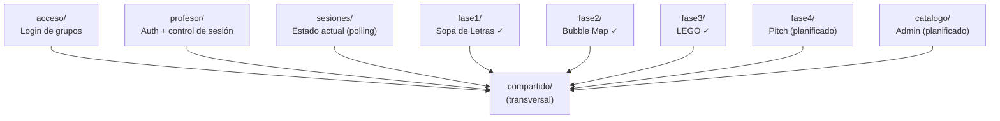
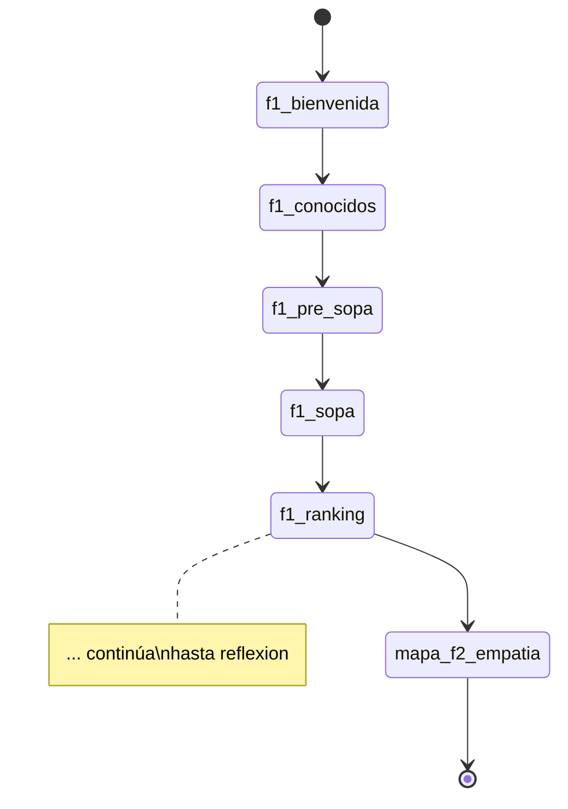
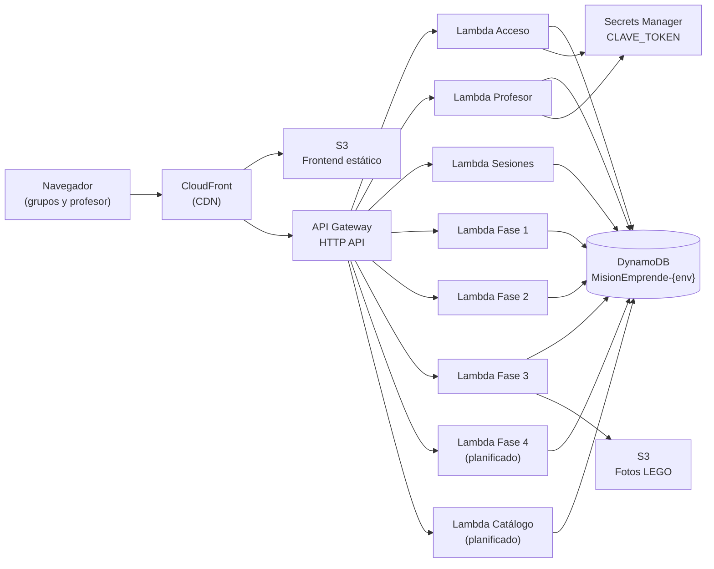
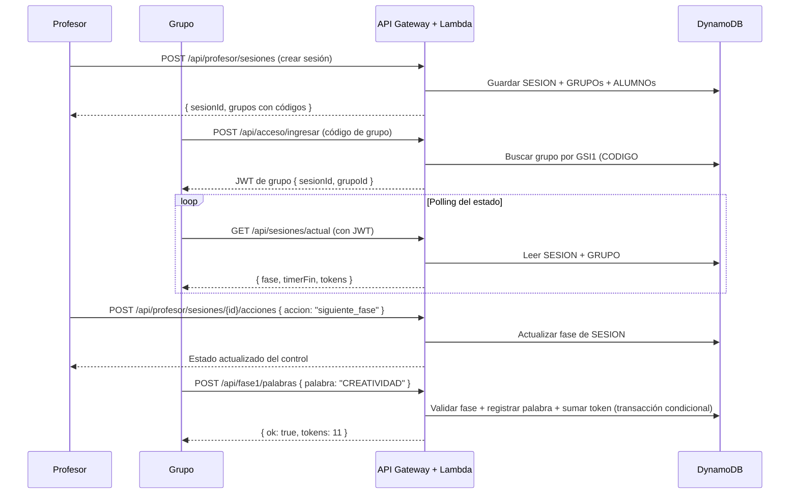

# Informe de Arquitectura Técnica
## Misión Emprende UDD

**Proyecto:** PROYECTO-INGENIERIA-DE-SOFTWARE-BMAD  
**Fecha:** 2026-07-27  
**Autor:** Equipo de Ingeniería de Software  

---

## 1. Visión General del Sistema

Misión Emprende UDD es una plataforma educativa gamificada que permite a un profesor de la Universidad del Desarrollo conducir sesiones de emprendimiento en clase. Los estudiantes, organizados en grupos, compiten y colaboran a través de cuatro fases: Sopa de Letras (trabajo en equipo), Bubble Map de Empatía, Creatividad LEGO y Pitch con evaluación cruzada.

El sistema opera en producción real sobre AWS. Su propósito académico es demostrar que una arquitectura serverless con Clean Architecture puede mantenerse en producción bajo uso real, con múltiples sesiones simultáneas y sin intervención manual de infraestructura.

### Usuarios del sistema

| Rol | Descripción |
|---|---|
| **Administrador** | Configura el catálogo de temáticas y desafíos del sistema |
| **Profesor** | Crea sesiones, forma grupos, controla el avance entre fases y evalúa pitches |
| **Grupo de estudiantes** | Participa en las actividades de cada fase desde un dispositivo compartido |

---

## 2. Paradigma Arquitectónico: Clean Architecture Serverless

### 2.1 Por qué Clean Architecture

El objetivo del proyecto no es solo construir el sistema — es demostrar que sus reglas de negocio (cuántos tokens entrega una acción, cómo avanza una fase, cómo se calcula el ranking) son **independientes de la infraestructura**. Si mañana DynamoDB se reemplaza por PostgreSQL, las reglas del juego no deben cambiar.

Clean Architecture resuelve esto separando el sistema en capas con una regla única: **las dependencias siempre apuntan hacia el núcleo**, nunca hacia afuera.

### 2.2 Estructura de cada módulo

Cada módulo de dominio tiene exactamente tres archivos:

```
fase1/
  api.ts        ← adaptador de ENTRADA: recibe el evento Lambda, llama al servicio
  servicio.ts   ← NÚCLEO: reglas del juego, sin saber nada de AWS
  repositorio.ts← adaptador de SALIDA: todo lo que toca DynamoDB
```

La dirección de dependencias es siempre la misma:

```
api.ts  ──→  servicio.ts  ──→  «interfaz» Repositorio
                                      ↑
                               repositorio.ts (implementación DynamoDB)
```

`servicio.ts` nunca importa el AWS SDK. Si un test quiere probar la lógica de negocio, simplemente pasa un repositorio falso — sin mocks de framework, sin DynamoDB real.

### 2.3 Inyección de dependencias sin contenedor IoC

Las funciones Lambda no tienen servidor persistente. En lugar de un contenedor IoC, la dependencia se pasa como parámetro:

```typescript
// El handler instancia el repositorio y lo pasa al servicio
export async function manejador(event) {
  const repositorio = new RepositorioFase1Real();
  const resultado = await enviarPalabra(
    contexto.sesionId,
    contexto.grupoId,
    "CREATIVIDAD",
    repositorio        // ← inyección explícita
  );
  return respuestaJson(200, resultado);
}
```

Esto permite que las pruebas pasen un repositorio falso sin ninguna librería de mocking.

---

## 3. Módulos del Sistema

### 3.1 Mapa de módulos



Todos los módulos funcionales dependen de `compartido/`, pero **ningún módulo depende de otro módulo funcional**. Esta regla es un invariante del sistema.

### 3.2 Módulo compartido/

`compartido/` es la única dependencia legítima entre módulos. Tiene responsabilidades fijas y acotadas:

| Archivo | Responsabilidad |
|---|---|
| `baseDatos.ts` | Cliente DynamoDB + función `nombreTabla()` |
| `respuestas.ts` | `respuestaJson`, `leerJson`, `responderError`, clase `ErrorAplicacion` |
| `seguridad.ts` | Crear/validar tokens de grupo y profesor |
| `maquinaEstados.ts` | **Lista canónica de fases, tiempos por defecto, constantes de estado** *(a crear)* |
| `contratos/` | Interfaces de datos compartidos entre fases *(a crear según necesidad)* |

### 3.3 Regla de dependencias entre fases

Las fases **no se importan directamente entre sí**. Cuando `fase4` necesita leer el resultado del LEGO de `fase3`, no importa `fase3/repositorio.ts` — define un contrato explícito en `compartido/contratos/`:

```typescript
// compartido/contratos/RepositorioResultadoLego.ts
export interface RepositorioResultadoLego {
  buscarResultadoLego(sesionId: string, grupoId: string): Promise<ResultadoLego | null>;
}
```

`fase3` cumple ese contrato al guardar. `fase4` lo usa para leer. Ninguno conoce la implementación DynamoDB del otro.

---

## 4. Máquina de Estados del Juego

### 4.1 Diseño

La sesión avanza por 24 estados en orden estricto. La definición canónica vive en `compartido/maquinaEstados.ts` — no en el módulo `profesor` ni duplicada en cada fase:

```
f1_bienvenida → f1_conocidos → f1_pre_sopa → f1_sopa → f1_ranking →
mapa_f2_empatia → f2_transicion → f2_tematicas → f2_transicion_empatia → f2_bubblemap → f2_ranking →
mapa_f3_creatividad → f3_transicion_creatividad → f3_lego → f3_ranking →
mapa_f4_final → f4_transicion_comunicacion → f4_construccion_pitch → f4_orden_pitch → f4_presentacion_pitch →
f5_transicion_apoyo → f5_evaluacion_pitch → f6_ranking →
reflexion
```

### 4.2 Control de transiciones

Solo el profesor puede avanzar o retroceder entre estados. El backend valida que la transición sea al estado sucesor directo — cualquier salto ilegal retorna error 400.



### 4.3 Temporizadores

Al entrar a una fase con timer, el sistema guarda `timerInicio` y `timerFin` en DynamoDB. El frontend calcula el tiempo restante como:

```
segundosRestantes = timerFin − ahoraUTC   (en el cliente)
```

El servidor es la única fuente de verdad del tiempo — no el reloj del dispositivo. Todos los dispositivos conectados ven el mismo contador.

### 4.4 Validación de estado en cada módulo

Antes de aceptar cualquier acción de grupo, el servicio de cada fase verifica que la sesión esté en la fase correcta usando constantes de `compartido/maquinaEstados.ts`:

```typescript
import { FASES } from "../compartido/maquinaEstados.js";

if (sesion.fase !== FASES.F1_SOPA) {
  throw new ErrorAplicacion("Fase incorrecta", 409, "FASE_INCORRECTA");
}
```

---

## 5. Modelo de Datos

### 5.1 Single-table DynamoDB

Todo el sistema usa una sola tabla DynamoDB por entorno (`MisionEmprende-dev`, `MisionEmprende-prod`). Esto es una decisión de diseño deliberada para mantener baja latencia y aprovechar las transacciones atómicas.

```mermaid
erDiagram
  SESION {
    string PK "SESION#{sesionId}"
    string SK "METADATOS"
    string GSI1PK "PROFESOR#{profesorId}"
    string GSI1SK "SESION#{timestamp}#{sesionId}"
    string fase "estado actual del juego"
    boolean timerCorriendo
    string timerFin "ISO 8601 UTC"
  }
  GRUPO {
    string PK "SESION#{sesionId}"
    string SK "GRUPO#{grupoId}"
    string GSI1PK "CODIGO#{codigoAcceso}"
    string GSI1SK "GRUPO#{grupoId}"
    number tokens "acumulados en todas las fases"
  }
  ALUMNO {
    string PK "SESION#{sesionId}"
    string SK "ALUMNO#{alumnoId}"
    string grupoId
  }
  SESION ||--o{ GRUPO : contiene
  SESION ||--o{ ALUMNO : contiene
  GRUPO ||--o{ ALUMNO : agrupa
```

### 5.2 Acceso por GSI

El índice secundario GSI1 resuelve búsquedas que el índice primario no puede:

| Búsqueda | Acceso |
|---|---|
| Todas las sesiones de un profesor | `GSI1PK = PROFESOR#{profesorId}` |
| Grupo por código de acceso | `GSI1PK = CODIGO#{codigo}` |

### 5.3 Idempotencia

Toda operación que entregue tokens usa `ConditionExpression` en DynamoDB para garantizar que ejecutar la misma acción N veces tenga el mismo efecto que ejecutarla una sola vez. Esto es crítico: una entrega duplicada de tokens durante una sesión de clase es irreversible socialmente.

---

## 6. Modelo de Autenticación

### 6.1 Autenticación de grupos

El grupo ingresa con un código de acceso alfanumérico de 6 caracteres. El backend valida el código en DynamoDB y emite un JWT firmado con HMAC-SHA256:

```
{ sesionId, grupoId, tipo: "grupo", exp }
```

Este token identifica al grupo en todas las llamadas subsiguientes. El frontend lo guarda en `localStorage` como `tokenAcceso`.

### 6.2 Autenticación de profesores

El profesor autentica con su `profesorId` y contraseña. El backend emite un JWT interno:

```
{ profesorId, rol: "profesor", tipo: "profesor", exp }
```

La clave de firma vive en AWS Secrets Manager (nunca en variables de entorno del repositorio).

> **Deuda técnica:** La implementación actual usa una contraseña compartida y el token de profesor no lleva `profesorId`. Esto significa que FR-005 (aislamiento entre profesores) no está efectivamente implementado. El equipo debe incluir `profesorId` en el token antes de la entrega si FR-005 está en el alcance del sprint.

### 6.3 Plan de contingencia Cognito

Si Amazon Cognito está disponible en la cuenta educativa, el profesor se autentica vía Cognito User Pool y API Gateway valida el token automáticamente. Si no está disponible (restricción AWS Academy), el JWT interno descrito arriba sirve como plan B completo — la lógica de negocio no cambia.

---

## 7. Infraestructura AWS

### 7.1 Diagrama de componentes



### 7.2 Infraestructura como código

Toda la infraestructura se define en `template.yaml` con AWS SAM. La consola AWS se usa solo para observación — nunca para crear o modificar recursos en producción.

### 7.3 Entornos

El sistema tiene dos entornos completamente aislados:

| Recurso | dev | prod |
|---|---|---|
| Tabla DynamoDB | `MisionEmprende-dev` | `MisionEmprende-prod` |
| PITR | deshabilitado | habilitado (NFR-016) |
| CORS | `*` | solo dominio CloudFront |

### 7.4 Restricciones del entorno educativo (AWS Academy)

| Restricción | Impacto | Adaptación |
|---|---|---|
| `iam:CreateRole` denegado | No se pueden crear roles IAM por Lambda | Todas las Lambdas usan `LabRole` |
| Credenciales rotan por sesión | Pipeline CI/CD no puede ejecutarse automáticamente | Los pasos del pipeline se ejecutan manualmente en el mismo orden |
| Cognito por confirmar | FR-001 bloqueado hasta verificar | Plan B: JWT interno firmado con clave en Secrets Manager |

---

## 8. Flujo de una Sesión Completa



---

## 9. Rankings

Los rankings se calculan síncronamente cuando el endpoint es llamado (`GET /api/faseN/ranking`). El cálculo lee el estado actual de todos los grupos de la sesión desde DynamoDB y retorna la clasificación ordenada por tokens.

No se usa EventBridge ni procesamiento asíncrono para rankings — la escala del sistema (máximo 10 grupos × 3 sesiones) no lo justifica. Esta decisión puede revisarse si se requiere demostrar arquitectura event-driven.

---

## 10. Pruebas

### 10.1 Filosofía

Las pruebas de negocio no necesitan AWS. Cada test pasa un repositorio falso al servicio — un objeto TypeScript que cumple la misma interfaz sin tocar DynamoDB:

```typescript
describe("Fase 1 — Sopa de Letras", () => {
  it("entrega 1 token por cada palabra nueva encontrada", async () => {
    const repositorio = crearRepositorioFalso({ tokens: 10 });
    await enviarPalabra("sesion1", "grupo1", "CREATIVIDAD", repositorio);
    expect(repositorio.getTokens("grupo1")).toBe(11);
  });
});
```

### 10.2 Qué se prueba y qué no

| Se prueba (servicio.ts) | No se prueba aquí |
|---|---|
| Reglas del juego (tokens, transiciones, idempotencia) | Rutas HTTP (api.ts) |
| Casos límite (segunda llamada, orden de llegada) | Queries DynamoDB (repositorio.ts) |
| Condiciones de victoria y ranking | Infraestructura AWS |

### 10.3 Ejecutar pruebas

```bash
cd backend-serverless
npm run pruebas        # solo tests
npm run verificar      # tipos TypeScript + tests + verificación de bundle
```

---

## 11. Pipeline CI/CD

El pipeline define los mismos pasos en todos los entornos. En AWS Academy se ejecuta manualmente por restricciones de credenciales:

```
1. type-check TypeScript (tsc --noEmit)
2. Pruebas Vitest (npm run pruebas)
3. Empaquetado esbuild (sam build)
4. Validación SAM (sam validate)
5. Despliegue a dev (sam deploy --config-env dev)
6. [Aprobación] Despliegue a prod (sam deploy --config-env prod)
```

En una cuenta con credenciales estables (OIDC o IAM de larga duración), este mismo flujo se activa automáticamente en GitHub Actions.

---

## 12. Decisiones Arquitectónicas Clave

Esta sección resume las decisiones tomadas durante el diseño de la arquitectura y el problema que cada una previene.

| ID | Decisión | Problema que previene |
|---|---|---|
| AD-1 | Sin imports entre repositorios de módulos distintos | Dos fases evolucionando la misma entidad DynamoDB de forma incompatible |
| AD-2 | Máquina de estados en `compartido/maquinaEstados.ts` | Strings de fase hardcodeados por módulo; lógica de transición duplicada |
| AD-3 | Token de profesor lleva `profesorId` estable | Un profesor con token válido accede a sesiones de otro |
| AD-4 | Rankings sincrónicos (EventBridge diferido) | Complejidad de infraestructura sin beneficio real a esta escala |
| AD-5 | Dependencias siempre hacia el núcleo | Lógica de negocio en api.ts; queries DynamoDB en servicio.ts |
| AD-6 | Tabla DynamoDB única con GSI | Múltiples tablas por dominio; joins cross-tabla |
| AD-7 | Autenticación solo via helpers de `compartido/seguridad.ts` | Validación manual del token en código de aplicación |

---

## 13. Trabajo Pendiente

Los siguientes ítems están identificados como pendientes antes de la entrega o despliegue de producción:

| Ítem | Urgencia | Descripción |
|---|---|---|
| `profesorId` en token (AD-3) | Alta | Sin esto, FR-005 no está implementado |
| `compartido/maquinaEstados.ts` | Alta | Extraer `FASES_ORDEN` de `profesor/servicio.ts` |
| `fase4/` — Pitch y Evaluación | Alta | Módulo completo por implementar |
| `catalogo/` — Admin | Alta | Módulo completo por implementar |
| PITR habilitado en prod | Media | `template.yaml` actual lo tiene deshabilitado |
| S3 + CloudFront en template.yaml | Media | Infraestructura de frontend y fotos LEGO no está en SAM |
| Verificar Cognito en AWS Academy | Media | Desbloquea FR-001; si no está disponible, confirmar Plan B |
