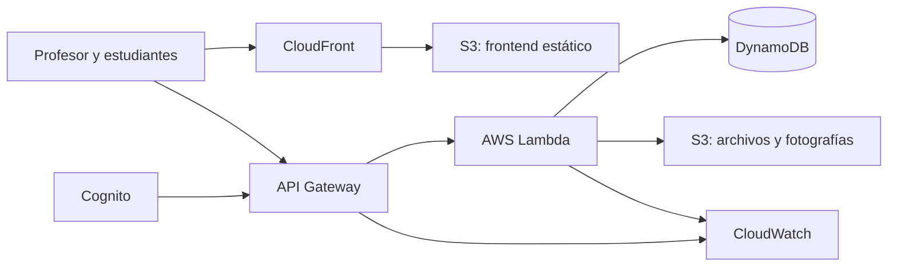

# Diagnóstico y orientación arquitectónica de Misión Emprende

## 1. Contexto de esta conversación

Misión Emprende corresponde a un proyecto desarrollado anteriormente en los ramos de Ingeniería de Software y UX/UI. Actualmente se retomó para el ramo de Arquitectura de Sistemas.

El objetivo académico general es transformar y completar el proyecto aplicando una arquitectura limpia (*Clean Architecture*) y desplegarlo en AWS mediante una solución serverless.

La rama actual contiene la última versión desarrollada por un compañero. Entre sus cambios conocidos se encuentran:

- Implementación de funciones AWS Lambda.
- Creación de APIs.
- Migración de la lógica del backend desde Python/Django a TypeScript/JavaScript.
- Incorporación de DynamoDB.
- Incorporación de AWS SAM.
- Migración parcial del frontend para consumir el backend serverless.

Los objetivos planteados para continuar el proyecto son:

- Comprender el sistema existente antes de modificarlo.
- Terminar de convertir el proyecto en una solución serverless.
- Integrar las herramientas y patrones enseñados por el profesor.
- Utilizar AWS SAM para definir y desplegar la infraestructura.
- Dejar el proyecto funcionando completamente en AWS.
- Depurar código antiguo, duplicado o innecesario.
- Aplicar patrones como Cache Aside cuando exista un caso de uso válido.
- Mejorar la separación entre lógica de negocio y herramientas externas.
- Aplicar Clean Architecture de forma verificable.
- Comprender los conceptos y las razones detrás de cada decisión.

## 2. Idea principal

“Serverless” y “Clean Architecture” describen dimensiones diferentes del sistema:

- **Serverless** indica cómo se ejecuta y administra la infraestructura.
- **Clean Architecture** indica cómo se organiza el código y en qué dirección dependen sus componentes.

Un proyecto puede ser serverless y tener una mala separación de responsabilidades. También puede tener Clean Architecture y ejecutarse en servidores tradicionales.

El proyecto avanzó considerablemente hacia serverless, pero todavía no implementa completamente Clean Architecture ni está listo para considerarse una solución completa de producción en AWS.

## 3. Estado actual del proyecto

Actualmente conviven dos arquitecturas.

### 3.1 Implementación antigua

En la raíz todavía se encuentran componentes de la solución anterior:

- Django y Python.
- Configuración aparentemente orientada a MySQL.
- `manage.py`.
- `config/`.
- `requirements.txt`.
- `Dockerfile`.
- `docker-compose.yml`.
- `db_backup.json`.
- Archivos multimedia almacenados localmente.

Esta versión parece incompleta en la rama actual. Por ejemplo, `config/urls.py` intenta importar `juego.urls`, pero la aplicación `juego` no se encuentra en el repositorio.

Estos archivos no deben eliminarse inmediatamente. Antes se debe verificar:

1. Si contienen información que aún necesita migrarse.
2. Si `db_backup.json` posee datos necesarios.
3. Si existen fotografías u otros archivos que deban trasladarse a S3.
4. Si la versión serverless reproduce completamente el comportamiento anterior.
5. Si existe una rama o etiqueta Git desde la cual recuperar la implementación antigua.

### 3.2 Implementación nueva

La nueva solución utiliza:

- TypeScript y Node.js.
- AWS Lambda.
- Amazon API Gateway.
- Amazon DynamoDB.
- AWS SAM.
- Frontend estático en HTML, CSS y JavaScript.

La implementación principal se encuentra en:

```text
backend-serverless/
```

El compañero ya implementó una parte significativa:

- Acceso de estudiantes.
- Acceso básico del profesor.
- Creación y control de sesiones.
- Consulta del estado actual.
- Fase 1.
- Fase 2.
- Fase 3.
- Rankings.
- Tokens firmados.
- Operaciones condicionales y transacciones de DynamoDB.
- Pruebas automatizadas.
- Configuración para ejecutar DynamoDB y SAM localmente.

## 4. Estructura actual del backend

Cada módulo utiliza aproximadamente esta organización:

```text
api.ts → servicio.ts → repositorio.ts → DynamoDB
```

Las responsabilidades esperadas son:

| Componente | Responsabilidad |
| --- | --- |
| `api.ts` | Recibir eventos de API Gateway, interpretar HTTP y producir respuestas JSON |
| `servicio.ts` | Ejecutar reglas del juego y casos de uso |
| `repositorio.ts` | Leer y escribir datos mediante DynamoDB |

Esta es una arquitectura por capas razonable y constituye un buen comienzo.

Los servicios reciben un repositorio como argumento. Por ejemplo:

```ts
obtenerEstadoFase1(sesionId, grupoId, repositorio);
```

Esto corresponde a inyección de dependencias y permite probar la lógica con un repositorio falso, sin conectarse a AWS.

## 5. Por qué todavía no es Clean Architecture completa

En Clean Architecture, las dependencias deben apuntar hacia el núcleo:

```text
AWS y API Gateway
        ↓
Adaptadores de infraestructura y presentación
        ↓
Casos de uso de la aplicación
        ↓
Entidades y reglas del dominio
```

El dominio y los casos de uso no deberían conocer:

- AWS Lambda.
- API Gateway.
- DynamoDB.
- El SDK de AWS.
- Variables específicas de despliegue.
- Detalles del framework.

En el código actual, los archivos `repositorio.ts` contienen simultáneamente:

- Interfaces requeridas por los servicios.
- Modelos utilizados por el negocio.
- Conversión de datos.
- Importaciones del SDK de AWS.
- Implementación concreta de DynamoDB.

Esto mezcla los puertos de la aplicación con los adaptadores de infraestructura.

Una estructura objetivo posible es:

```text
src/
├── dominio/
│   ├── entidades/
│   ├── errores/
│   └── reglas/
├── aplicacion/
│   ├── casos-uso/
│   └── puertos/
├── infraestructura/
│   ├── dynamodb/
│   ├── seguridad/
│   └── configuracion/
└── presentacion/
    └── lambdas/
```

No es recomendable reorganizar todo el backend de una vez. Primero se debe aplicar el patrón a un módulo pequeño, verificarlo y después repetirlo gradualmente.

## 6. Arquitectura AWS objetivo

Una solución serverless completa podría tener este flujo:



Responsabilidades:

| Servicio | Responsabilidad |
| --- | --- |
| S3 | Guardar el frontend y archivos como fotografías |
| CloudFront | Entregar el frontend por HTTPS desde una dirección estable |
| API Gateway | Exponer las rutas HTTP |
| Lambda | Ejecutar los casos de uso |
| DynamoDB | Persistir sesiones, grupos, progreso y puntajes |
| Cognito | Autenticar profesores y, si se decide, otros usuarios |
| CloudWatch | Registrar logs, métricas y alarmas |
| SAM | Definir la infraestructura como código |
| Secrets Manager o SSM | Almacenar secretos y configuración sensible |

## 7. Infraestructura que ya existe en SAM

El archivo `backend-serverless/template.yaml` declara actualmente:

- Un HTTP API de API Gateway.
- Seis funciones Lambda:
  - Acceso.
  - Profesor.
  - Sesiones.
  - Fase 1.
  - Fase 2.
  - Fase 3.
- Una tabla DynamoDB.
- Rutas HTTP para los módulos anteriores.
- Variables de entorno compartidas.
- Salidas con la URL de la API y datos de la tabla.

Esto significa que el backend ya posee una base de infraestructura como código.

## 8. Elementos que faltan para completar AWS

### 8.1 Infraestructura del frontend

El template actual no declara:

- Bucket S3 para el frontend.
- Distribución CloudFront.
- Política de acceso del bucket.
- Configuración del documento inicial.
- Dominio o certificado.
- Bucket para fotografías LEGO.
- Procedimiento automatizado para publicar el frontend.

Por esto, la solución completa todavía no es totalmente serverless, aunque su backend sí se encuentre encaminado.

### 8.2 Configuración por ambiente

El frontend tiene una URL temporal de GitHub Codespaces escrita directamente en:

```text
frontend/compartido/js/api.js
```

La URL debe poder configurarse según el ambiente:

```text
local → http://127.0.0.1:3000
dev   → URL de API Gateway de desarrollo
prod  → URL de API Gateway de producción
```

No se debe modificar manualmente el código cada vez que se despliegue.

### 8.3 Seguridad e IAM

Las Lambdas usan directamente un ARN de `LabRole` ligado a una cuenta AWS determinada.

Problemas posibles:

- La infraestructura queda ligada a una cuenta.
- El rol puede poseer permisos demasiado amplios.
- El template pierde portabilidad.
- Puede incumplirse el principio de mínimo privilegio.

En AWS Academy puede ser obligatorio utilizar `LabRole`. Si ese es el caso, debe quedar documentado como una restricción del ambiente académico.

También existen valores predeterminados que solo son aceptables durante desarrollo:

- Contraseña compartida del profesor.
- Clave de tokens de ejemplo.
- CORS configurado con `*`.

### 8.4 Autenticación del profesor

El acceso actual utiliza una contraseña compartida. El sistema reconoce el rol de profesor, pero no necesariamente la identidad individual de cada profesor.

Una alternativa más completa sería:

- Amazon Cognito.
- Un identificador individual por profesor.
- Comprobación de propiedad de las sesiones.
- Autorización por ruta.
- Autorizador en API Gateway o validación equivalente.

### 8.5 Funcionalidades restantes

La nueva implementación llega principalmente hasta la Fase 3. Según el flujo esperado, se deben revisar:

- Subida de fotografías LEGO a S3.
- Fase 4 o pitch.
- Evaluación.
- Ranking final.
- Cierre de una sesión.
- Consulta y exportación de resultados.

Antes de implementarlas se debe contrastar esta lista con la pauta oficial del profesor.

### 8.6 Observabilidad

CloudWatch recibirá logs de Lambda, pero todavía se necesita una estrategia explícita:

- Logs JSON estructurados.
- Identificador de solicitud.
- Métricas de errores y latencia.
- Alarmas.
- Retención de logs.
- Trazabilidad.
- Endpoint de salud.

### 8.7 Automatización

Conviene agregar una pipeline que realice:

1. Validación de tipos.
2. Pruebas automatizadas.
3. Validación del template SAM.
4. Construcción de las Lambdas.
5. Despliegue del backend por ambiente.
6. Publicación del frontend en S3.
7. Invalidación de CloudFront.

## 9. Cache Aside

Cache Aside es un patrón de acceso a datos:

```text
1. La aplicación consulta el caché.
2. Si el dato existe, lo devuelve.
3. Si no existe, consulta la base de datos.
4. Guarda temporalmente el resultado en el caché.
5. Devuelve el resultado.
```

Es apropiado para información:

- Consultada frecuentemente.
- Poco modificada.
- Costosa de recuperar.
- Que tolera estar desactualizada durante un periodo breve.

Posibles candidatos en Misión Emprende:

- Configuración global de fases.
- Catálogo de desafíos.
- Temáticas.
- Contenido parametrizable de baja frecuencia de cambio.

No conviene comenzar cacheando:

- Tokens de grupos.
- Contadores de grupos completados.
- Estado actual de una sesión.
- Transiciones de fase.
- Rankings que cambian constantemente.

Estos últimos requieren consistencia y un dato desactualizado podría alterar el funcionamiento del juego.

Lambda puede reutilizar variables globales entre algunas invocaciones, pero esa memoria no está garantizada. Puede utilizarse como optimización temporal, nunca como fuente confiable del estado.

Si el requisito exige un caché distribuido, se debe determinar si el profesor espera:

- ElastiCache/Redis.
- DynamoDB DAX.
- Otro servicio.

Introducir Redis y una VPC aumenta la complejidad operacional y debe justificarse mediante un caso de uso.

## 10. Otros paradigmas y patrones recomendados

### Programación por capas

```text
Presentación → Aplicación → Dominio ← Infraestructura
```

### Programación funcional

Utilizar funciones puras para cálculos como:

- Puntajes.
- Recompensas.
- Normalización.
- Temporizadores.
- Selección de desafíos.

### Inyección de dependencias

Los casos de uso deben recibir interfaces, no crear directamente clientes de AWS.

### Repository

Los casos de uso dependen de contratos de persistencia. DynamoDB implementa esos contratos desde la infraestructura.

### Máquina de estados

El juego avanza por etapas. Las transiciones deberían tener una definición central que indique:

- Estado actual.
- Acción permitida.
- Actor autorizado.
- Estado siguiente.
- Condiciones.
- Temporizador.

No conviene distribuir los nombres y reglas de las fases entre muchos archivos sin una fuente central.

### Arquitectura orientada a eventos

Puede incorporarse posteriormente para trabajos secundarios:

- Procesar fotografías.
- Generar informes.
- Enviar notificaciones.
- Registrar analítica.

No es necesario usar eventos para cada solicitud HTTP sencilla.

## 11. Orden recomendado de trabajo

### Etapa 1: reconstruir los requisitos

Reunir:

- Pauta del proyecto.
- Diagramas del profesor.
- Presentaciones.
- Servicios AWS exigidos.
- Patrones obligatorios.
- Criterios de evaluación.
- Restricciones de AWS Academy.

Se debe distinguir entre:

- Requisito académico.
- Requisito funcional.
- Mejora opcional.

### Etapa 2: crear un inventario funcional

Para cada pantalla registrar:

- Acción del usuario.
- Endpoint utilizado.
- Caso de uso.
- Datos leídos.
- Datos modificados.
- Estado de implementación.
- Pruebas existentes.

Estados recomendados:

```text
implementado | parcial | ausente | roto | no verificado
```

### Etapa 3: levantar el sistema localmente

1. Instalar dependencias de Node.
2. Ejecutar el chequeo de TypeScript.
3. Ejecutar las pruebas.
4. Construir con SAM.
5. Levantar DynamoDB local.
6. Preparar datos de prueba.
7. Levantar la API local.
8. Recorrer el flujo de profesor y estudiantes.

### Etapa 4: estabilizar el comportamiento

Antes de una refactorización grande se deben corregir:

- Rutas rotas.
- Configuración del frontend.
- Diferencias de contrato entre frontend y backend.
- Errores reproducibles.
- Pruebas que no representen el comportamiento esperado.

### Etapa 5: definir la arquitectura objetivo

Separar:

- Entidades y reglas del dominio.
- Casos de uso.
- Puertos o interfaces.
- Adaptadores de DynamoDB.
- Handlers Lambda.
- Configuración.
- Infraestructura SAM.

### Etapa 6: refactorizar una sección piloto

Aplicar Clean Architecture primero a un módulo pequeño, como `acceso`, o a una operación acotada de Fase 1.

Después:

1. Verificar pruebas.
2. Comparar complejidad.
3. Documentar el patrón.
4. Replicarlo en los demás módulos.

### Etapa 7: completar el flujo funcional

Implementar únicamente las funciones confirmadas por los requisitos:

- Fases faltantes.
- Fotografías.
- Evaluación.
- Ranking final.
- Resultados.

### Etapa 8: completar la infraestructura

Incorporar:

- S3.
- CloudFront.
- API Gateway.
- Lambda.
- DynamoDB.
- Autenticación.
- Secretos y configuración.
- Logs, métricas y alarmas.

### Etapa 9: desplegar desarrollo

Crear primero un ambiente `dev` y probar:

- Flujo funcional completo.
- Permisos.
- CORS.
- Persistencia.
- Rendimiento.
- Logs.
- Recuperación ante errores.

### Etapa 10: aplicar patrones académicos

Aplicar Cache Aside, eventos, colas u otros patrones solamente en casos justificables y acompañarlos de:

- Problema.
- Alternativas.
- Decisión.
- Consecuencias.
- Evidencia de funcionamiento.

### Etapa 11: automatizar y documentar

Completar:

- Pipeline.
- Diagramas.
- Decisiones arquitectónicas.
- Instrucciones de ejecución local.
- Instrucciones de despliegue.
- Procedimiento de recuperación.

## 12. Estado de la verificación técnica

Durante el diagnóstico se intentó ejecutar:

```bash
npm run verificar
```

La ejecución no pudo comenzar porque las dependencias de Node todavía no se encuentran instaladas:

```text
tsc: command not found
```

También se observó:

- Node.js está instalado.
- Docker está instalado.
- AWS SAM CLI no está disponible globalmente.
- No se modificó el código de la aplicación durante el diagnóstico.

## 13. Próximo paso recomendado

El siguiente paso práctico debe ser levantar el backend local y construir una matriz de funcionalidades.

La secuencia inmediata recomendada es:

```text
Requisitos del profesor
        ↓
Inventario funcional
        ↓
Ejecución local reproducible
        ↓
Pruebas y estabilización
        ↓
Clean Architecture incremental
        ↓
Funcionalidades faltantes
        ↓
Infraestructura AWS completa
        ↓
Despliegue y documentación
```

Este orden evita reorganizar código que todavía no ha sido entendido o implementar servicios AWS sin conocer el problema que deben resolver.
