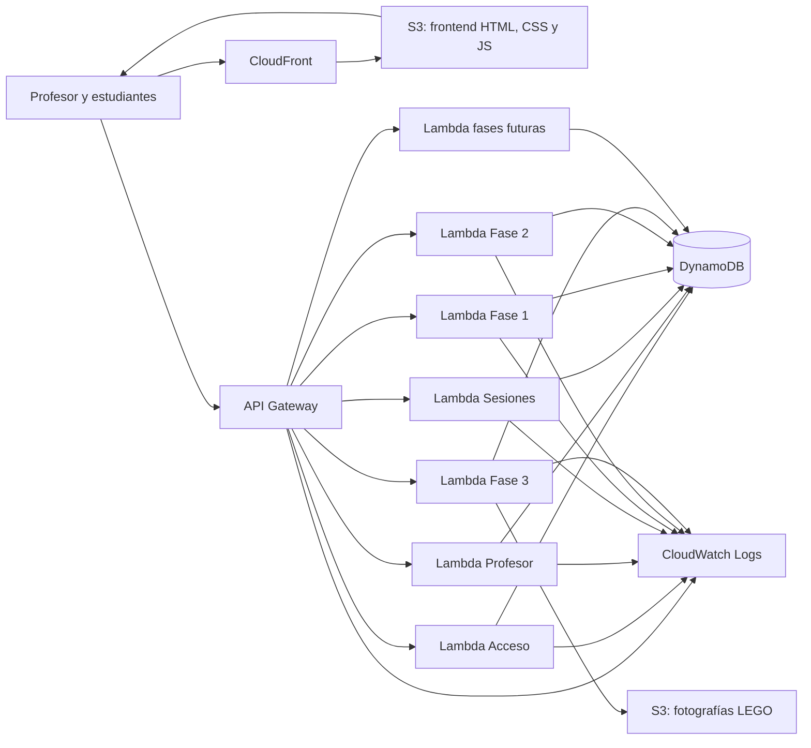
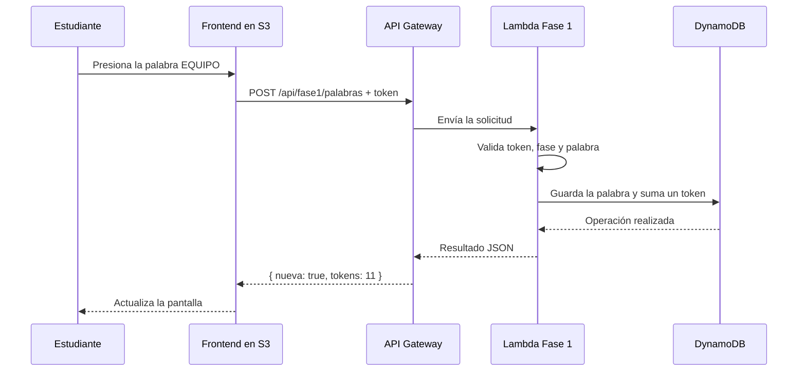
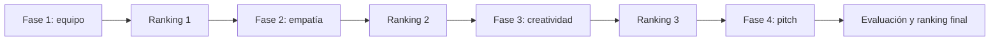
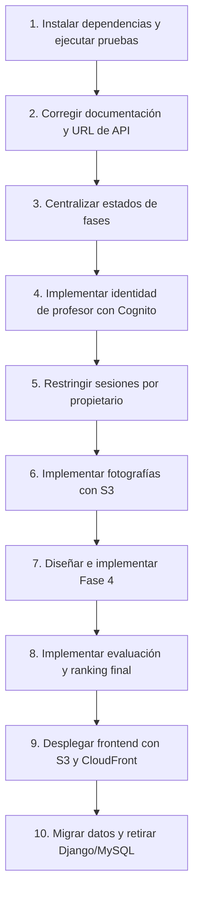

# Guía para entender y continuar la arquitectura de Misión Emprende UDD

> Documento de orientación para una persona que recién comienza en desarrollo de software.
> 
> 
> Objetivo: entender qué construyó el equipo, qué partes deben mantenerse, qué partes sobran y qué falta implementar para que toda la solución funcione en AWS.
> 

---

## 1. ¿Qué es Misión Emprende?

Misión Emprende es un juego educativo para una clase. En el juego existen dos tipos de personas:

- **El profesor**, que crea una sesión, forma grupos y controla en qué actividad se encuentra la clase.
- **Los estudiantes**, que ingresan con el código de su grupo y realizan desafíos para ganar tokens.

Podemos imaginar el sistema como un colegio:

- El **frontend** es la sala y las pantallas que ven las personas.
- La **API** es el encargado que recibe preguntas y solicitudes.
- Las funciones **Lambda** son los trabajadores que aplican las reglas.
- **DynamoDB** es el cuaderno donde se guarda todo.
- **AWS** es el edificio donde viven esas piezas.

El proyecto comenzó con Django y MySQL, pero ahora está siendo transformado en una solución *serverless* de AWS. La arquitectura que debe continuar es la nueva: frontend estático, API Gateway, Lambda y DynamoDB.

## 2. La arquitectura explicada de manera simple

Una arquitectura es un plano. Así como el plano de una casa indica dónde están la cocina y los dormitorios, el plano del software indica dónde está la interfaz, dónde están las reglas y dónde se guardan los datos.

La arquitectura objetivo es esta:



### ¿Qué hace cada servicio AWS?

| Servicio | Explicación sencilla | Responsabilidad |
| --- | --- | --- |
| Amazon S3 | Una caja para guardar archivos | Alojar HTML, CSS, JavaScript, imágenes, audio y fotos LEGO |
| CloudFront | Un repartidor rápido y seguro | Entregar el frontend mediante HTTPS y desde una dirección estable |
| API Gateway | La puerta de entrada | Recibir solicitudes HTTP y enviarlas a la Lambda correcta |
| AWS Lambda | Trabajadores que despiertan cuando se los llama | Ejecutar las reglas del juego |
| DynamoDB | Un cuaderno digital muy rápido | Guardar sesiones, grupos, alumnos, puntajes y progreso |
| CloudWatch | Cámara y libro de novedades | Registrar errores, tiempos y actividad técnica |
| AWS SAM | El plano que AWS puede leer | Crear y actualizar la infraestructura mediante código |
| Secrets Manager o SSM | Una caja fuerte | Guardar claves que no deben aparecer en el código |

“Serverless” no significa que no existan servidores. Significa que AWS administra los servidores y nosotros nos concentramos en el programa.

## 3. Cómo viaja una solicitud

Supongamos que un grupo encuentra la palabra `EQUIPO` en la sopa de letras:



La pantalla no debe decidir cuántos tokens gana el grupo. Esa regla debe vivir en el backend. De lo contrario, un estudiante podría modificar el JavaScript de su navegador y regalarse puntos.

## 4. Cómo está organizado el código actual

El proyecto nuevo vive principalmente en dos carpetas:

```
frontend/
├── acceso/          Pantallas de ingreso
├── profesor/        Panel del profesor
├── juego/fase1/     Actividades de Fase 1
├── juego/fase2/     Actividades de Fase 2
├── juego/fase3/     Actividades de Fase 3
├── juego/mapa/      Transiciones entre habilidades
└── compartido/      API, imágenes, audio y video

backend-serverless/
├── src/acceso/      Ingreso mediante código de grupo
├── src/profesor/    Creación y control de sesiones
├── src/sesiones/    Consulta de la sesión actual
├── src/fase1/       Reglas de Fase 1
├── src/fase2/       Reglas de Fase 2
├── src/fase3/       Reglas de Fase 3
├── src/compartido/  Seguridad, errores y conexión a DynamoDB
├── pruebas/         Pruebas automáticas
└── template.yaml    Definición de recursos AWS
```

Cada módulo del backend tiene tres archivos. Esta separación es importante y conviene conservarla:

| Archivo | Pregunta que responde | Ejemplo |
| --- | --- | --- |
| `api.ts` | ¿Qué ruta llamaron y qué datos llegaron? | Detecta `POST /api/fase1/palabras` |
| `servicio.ts` | ¿Está permitido y cuál es la regla? | Una palabra nueva entrega un token |
| `repositorio.ts` | ¿Cómo leo o guardo el dato? | Ejecuta una operación en DynamoDB |

Esta forma de organizar el código permite cambiar DynamoDB o una regla sin desarmar todo el sistema.

## 5. Paradigmas de programación que debes aplicar

Un paradigma es una manera ordenada de pensar el programa. No es necesario reescribir todo usando clases. Para este proyecto conviene combinar los siguientes enfoques.

### 5.1 Programación por capas

Es el paradigma principal que ya comenzó a usarse:

```
API → Servicio → Repositorio → DynamoDB
```

Regla práctica:

- Si estás leyendo HTTP, trabaja en `api.ts`.
- Si estás decidiendo puntos, fases o permisos, trabaja en `servicio.ts`.
- Si estás escribiendo una consulta DynamoDB, trabaja en `repositorio.ts`.

No pongas consultas DynamoDB directamente en el frontend ni reglas de puntaje en `api.ts`.

### 5.2 Programación funcional

Las reglas pequeñas deben ser funciones que reciban datos y devuelvan un resultado sin modificar cosas escondidas.

```tsx
function calcularRecompensa(puntaje: number): number {
  return Math.max(0, Math.min(10, puntaje));
}
```

Este tipo de función es fácil de probar. Úsalo para puntajes, normalización de formularios, selección de desafíos y cálculo de tiempo.

### 5.3 Inyección de dependencias

Los servicios actuales reciben un repositorio como argumento. Esto permite probar las reglas con un repositorio falso, sin conectarse a AWS:

```tsx
completarActividad(sesionId, grupoId, repositorioFalso);
```

Conserva este patrón. No importes la conexión real a DynamoDB dentro de las reglas de negocio.

### 5.4 Máquina de estados

La clase avanza por etapas, por lo que una sesión es una máquina de estados:



Una transición debe indicar claramente:

- Estado actual permitido.
- Acción que provoca el cambio.
- Estado siguiente.
- Duración del temporizador.
- Condición: profesor, un grupo o todos los grupos.

No conviene repartir esta lista entre varios archivos. Debe existir una definición central y compartida, por ejemplo `src/compartido/fases.ts`.

### 5.5 Arquitectura orientada a eventos, más adelante

Las solicitudes HTTP pueden seguir siendo la base. Para trabajos secundarios, como generar un informe o procesar una foto, se puede publicar un evento en EventBridge o SQS. No es necesario introducirlo para acciones simples del juego.

## 6. Cómo se guardan los datos

DynamoDB usa una sola tabla y distingue los registros mediante `PK` y `SK`:

```
PK                         SK
SESION#123                 METADATOS
SESION#123                 GRUPO#A
SESION#123                 GRUPO#B
SESION#123                 ALUMNO#1
SESION#123                 PALABRA#A#EQUIPO
```

Todos los elementos de una sesión comparten la misma `PK`. Es como guardar todas las hojas de una clase en una misma carpeta.

El índice `GSI1` permite buscar:

- Un grupo usando su código de acceso.
- Las sesiones asociadas a un profesor.

Antes de crear nuevos tipos de registro se deben escribir sus preguntas de acceso. Por ejemplo: “necesito obtener todas las evaluaciones de un grupo”. Después se diseña su `PK` y `SK`. En DynamoDB no se debe diseñar como si fuera MySQL.

## 7. Qué puedes tocar y qué debes cuidar

### Puedes modificar normalmente

- Los HTML, CSS y JavaScript dentro de `frontend/`.
- Las reglas de cada fase en `servicio.ts`.
- Las rutas de un módulo en su `api.ts` y en `template.yaml` al mismo tiempo.
- Las operaciones de datos en `repositorio.ts`.
- Las pruebas en `backend-serverless/pruebas/`.
- La configuración de infraestructura en `template.yaml`, revisando primero su efecto.

### Toca con mucho cuidado

- `src/compartido/seguridad.ts`: un error puede permitir acceso indebido o invalidar todos los tokens.
- Las claves `PK`, `SK`, `GSI1PK` y `GSI1SK`: cambiarlas sin una migración puede hacer invisibles los datos existentes.
- Los nombres de las fases: frontend, profesor y backend dependen de los mismos textos.
- Las operaciones condicionales y transacciones: evitan entregar dos veces una recompensa.
- El formato de respuestas usado por el frontend.

### No debes hacer

- Guardar secretos dentro del repositorio.
- Permitir que el frontend calcule o escriba directamente tokens.
- Conectar el navegador directamente a DynamoDB.
- crear una segunda tabla por cada pantalla sin justificar el patrón de acceso.
- Cambiar una ruta del backend sin actualizar el frontend y SAM.
- Dar permisos generales de administrador a una Lambda.

## 8. Qué conviene eliminar o archivar

En la raíz todavía existe una versión incompleta basada en Django y MySQL:

- `manage.py`
- `config/`
- `requirements.txt`
- `Dockerfile`
- `docker-compose.yml`
- `db_backup.json`
- `media/` con archivos de la implementación anterior

La configuración Django intenta cargar una aplicación llamada `juego`, pero esa carpeta no existe. Además, la arquitectura nueva declara que ya no utiliza Django.

No conviene borrar estos archivos inmediatamente. Primero se debe:

1. Crear una rama o etiqueta Git de respaldo.
2. Confirmar que `db_backup.json` y `media/` no contienen datos que deban migrarse.
3. Migrar a DynamoDB los datos que aún sean necesarios.
4. Migrar las fotografías válidas a S3.
5. Documentar el procedimiento de recuperación.
6. Eliminar la arquitectura Django/MySQL en un cambio separado y revisable.

También deben revisarse los recursos multimedia duplicados o sin uso. El repositorio completo se acerca a 1 GB, principalmente por imágenes, audios y videos. Los archivos grandes deberían vivir en un bucket S3 y no duplicarse innecesariamente en Git.

## 9. APIs existentes y APIs que faltan

### APIs implementadas

Actualmente existen APIs para:

- Ingreso de grupos.
- Ingreso básico de profesor.
- Creación, listado y control de sesiones.
- Consulta del estado de una sesión.
- Actividades, progreso y ranking de Fases 1, 2 y 3.

### APIs prioritarias que faltan o deben completarse

| Prioridad | API propuesta | Motivo |
| --- | --- | --- |
| Alta | `POST /api/profesor/autenticacion` mediante Cognito | Reemplazar la clave común y reconocer a cada profesor |
| Alta | `POST /api/archivos/lego/presign` | Entregar una URL segura para subir una fotografía a S3 |
| Alta | `POST /api/fase3/lego/foto/confirmar` | Asociar el objeto S3 al grupo después de subirlo |
| Alta | APIs de Fase 4 | El flujo del profesor ya menciona pitch, pero no hay módulo completo |
| Alta | APIs de evaluación y ranking final | Completar las Fases 5 y 6 mencionadas en la máquina de estados |
| Media | `GET /api/profesor/sesiones/{id}/alumnos` | Consultar integrantes de manera explícita |
| Media | `POST /api/profesor/sesiones/{id}/grupos` | Permitir ajustes controlados de grupos |
| Media | `PATCH /api/profesor/sesiones/{id}` | Editar nombre o configuración sin mezclarlo con acciones |
| Media | `POST /api/profesor/sesiones/{id}/cerrar` | Cerrar una sesión e impedir nuevas acciones |
| Media | `GET /api/profesor/sesiones/{id}/resultados` | Exportar puntajes y progreso final |
| Media | `GET /api/salud` | Verificar despliegue y dependencias sin tocar datos del juego |
| Baja | `POST /api/telemetria/eventos` | Medir navegación si existe una necesidad real y consentimiento |

Las rutas de profesor deben comprobar que la sesión pertenece al profesor autenticado. El token actual solamente dice “soy profesor”; no identifica a una persona. Por eso un profesor autenticado podría intentar consultar una sesión ajena si conoce su ID.

Para Fases 4 a 6 conviene crear módulos con la estructura existente:

```
src/fase4/api.ts
src/fase4/servicio.ts
src/fase4/repositorio.ts
src/fase5/api.ts
src/fase5/servicio.ts
src/fase5/repositorio.ts
src/fase6/api.ts
src/fase6/servicio.ts
src/fase6/repositorio.ts
```

## 10. Cambios AWS necesarios antes de producción

1. **Frontend:** crear un bucket S3 privado y servirlo mediante CloudFront con HTTPS.
2. **Dominio:** usar Route 53 y certificados ACM si se dispone de un dominio.
3. **Autenticación:** usar Cognito para profesores. Los códigos de grupo pueden mantenerse, pero con límites de intentos y expiración.
4. **Secretos:** mover la clave de firma a Secrets Manager o Parameter Store y eliminar valores inseguros por defecto.
5. **Permisos:** reemplazar el ARN fijo de `LabRole` por roles IAM creados por SAM con el mínimo permiso necesario.
6. **CORS:** permitir solamente el dominio real de CloudFront, no  en producción.
7. **Fotografías:** crear un bucket S3 separado, bloquear acceso público y utilizar URLs prefirmadas.
8. **Base de datos:** activar cifrado y recuperación punto en el tiempo para producción.
9. **Observabilidad:** configurar logs estructurados, métricas, alarmas de errores Lambda y alarmas de API Gateway.
10. **Entornos:** mantener al menos `dev` y `prod` con tablas, buckets, dominios y secretos separados.

## 11. Orden recomendado de trabajo



Antes de empezar una fase nueva, escribe:

- Sus pantallas.
- Sus estados.
- Quién puede iniciar cada acción.
- Datos de entrada y salida.
- Regla de puntaje.
- Condición para avanzar.
- Registros que se guardarán.
- Pruebas necesarias.

Luego implementa en este orden: servicio, pruebas, repositorio, API, plantilla SAM y frontend. Así las reglas importantes se definen antes que los botones.

## 12. Lista de comprobación para cada cambio

Antes de dar una tarea por terminada, comprueba:

- [ ]  La regla está en `servicio.ts`.
- [ ]  La consulta está en `repositorio.ts`.
- [ ]  La ruta está en `api.ts` y `template.yaml`.
- [ ]  El usuario y su rol están validados.
- [ ]  La sesión pertenece al profesor o grupo autenticado.
- [ ]  Una solicitud repetida no duplica tokens ni avances.
- [ ]  Existe al menos una prueba del caso correcto y otra del error.
- [ ]  El frontend maneja errores y expiración del token.
- [ ]  No se incluyeron claves, cuentas o URLs temporales en el código.
- [ ]  Los permisos IAM son mínimos.
- [ ]  Los logs no muestran información sensible.
- [ ]  El cambio funciona primero en `dev` antes de pasar a `prod`.

## Conclusión

La arquitectura nueva tiene una base correcta: frontend separado, API Gateway como entrada, Lambdas divididas por función y una tabla DynamoDB compartida. Las primeras tres fases ya tienen reglas, sincronización y rankings. La prioridad no es reescribirlas, sino terminar la migración hacia AWS y cerrar los espacios incompletos.

La idea central que debes recordar es:

```
La pantalla muestra.
La API recibe.
El servicio decide.
El repositorio guarda.
AWS ejecuta y protege.
```

Si respetas esos límites, podrás agregar fases sin romper las anteriores. El siguiente objetivo debería ser asegurar la identidad del profesor, implementar la carga de fotos en S3, centralizar la máquina de estados y completar las APIs de las Fases 4 a 6. Solo después de migrar y verificar los datos antiguos conviene retirar definitivamente Django y MySQL.